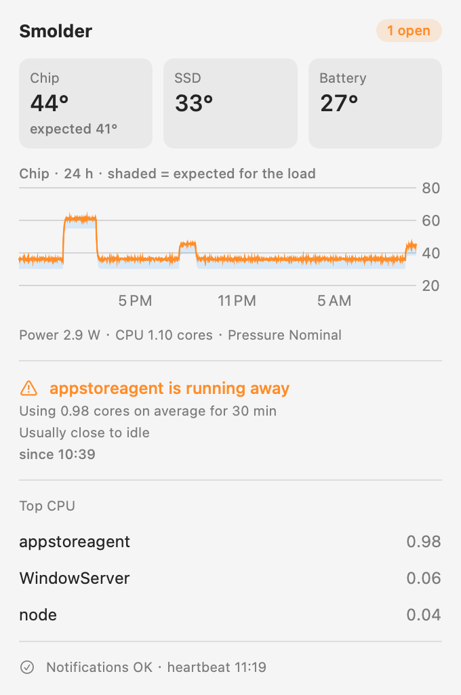

<p align="center">
  
</p>

<h1 align="center">Smolder</h1>

<p align="center"><b>Catch your Mac smoldering while the lid is closed.</b></p>

<p align="center">
  <a href="https://github.com/penntiao/smolder/actions/workflows/ci.yml"></a>
  
  
  <a href="LICENSE"></a>
</p>

<p align="center"><a href="README.zh-CN.md">简体中文</a></p>

---

Smolder is a small menu bar app for Macs that run all the time with nobody looking at them — a MacBook
closed on a shelf as a home server, a build box, an always-on AI agent machine. It learns what *normal*
looks like on your Mac and messages your phone when something is actually wrong.

It was born from a real incident: a background daemon got stuck in a retry loop and burned a full CPU core
for **eight hours** on a lid-closed MacBook Air. Nobody noticed. A temperature alarm would not have helped
either — on that day the battery never got hotter than 30.6 °C, while an ordinary half-hour of heavy work
the week before had reached 33.5 °C. **A fixed temperature threshold either misses the fault or cries wolf.**

So Smolder does not ask *"is it hot?"*. It asks *"is it hotter than what it is doing explains?"* and
*"is something doing work it never does?"*

<p align="center">
  
</p>

## What it watches

| Alert | Fires when | Why it is not a fixed threshold |
|---|---|---|
| **Runaway program** | A program uses far more CPU than *its own* usual peak (≥ 0.5 cores and ≥ 1.5× its 14-day peak) for 30 minutes | A compiler or AI agent that is busy every day is not flagged; a daemon that normally idles and suddenly burns a core is |
| **Busy in the background** | With every screen off, the *quietest* moments of the last two hours draw ≥ 1.5 W more than usual | Real work raises the power *peaks*; something that never stops raises the *floor*. A lit screen raises it too, so this is not judged while the Mac is in use |
| **Hotter than the load explains** | The chip runs ≥ 3 °C (or 4 residual MADs) above what the current power draw (system and P-core cluster) predicts, for 20 minutes, after correcting for the room over the last few hours | A learned power → temperature model: heavy work that runs hot is expected, and so is a warm afternoon; a blocked vent is not |
| **Hard limits** | macOS throttles for 10 minutes, critical thermal pressure, or battery ≥ 35 °C | Never learned, never adapted — the backstop for anything the baselines could absorb |

Each alert is one notification when it starts and one when it resolves, never a stream. Every message says
what was measured, what was expected and who is likely behind it:

```
🟠 appstoreagent is running away
Using 0.98 cores on average for 30 min
Usually close to idle
PID 4127 · /System/Library/PrivateFrameworks/…/appstoreagent
```

How the models work, and the research behind them, is in [docs/how-it-works.md](docs/how-it-works.md).

## Notifications

- **macOS notifications** — for when someone is at the Mac.
- **Telegram** — alerts to your chat, and the bot answers `/status` with live temperatures, load and the
  busiest programs. *Settings → Notifications → Detect* finds your chat ID for you.
- **Webhook** — POSTs JSON for every event (and, optionally, heartbeats).
- **Custom command** — runs anything you like with the same JSON on stdin; relay to your own server over SSH,
  pipe to `ntfy`, write to a log.
- **Dead man's switch** — Smolder cannot report its own death. Send heartbeats to healthchecks.io,
  Uptime Kuma or your own server and let *that* alert when they stop.

Check every destination from the terminal with `/Applications/Smolder.app/Contents/MacOS/Smolder --test-notify`.
Payloads and recipes: [docs/integrations.md](docs/integrations.md).

## Install

Requires an Apple Silicon Mac on macOS 14 Sonoma or later.

**Homebrew**

```bash
brew install --cask penntiao/tap/smolder
```

**Download** the zip from [Releases](https://github.com/penntiao/smolder/releases), unzip, move
`Smolder.app` to Applications, then right-click → Open the first time.

**From source** (Command Line Tools are enough, no Xcode needed)

```bash
git clone https://github.com/penntiao/smolder.git
cd smolder
scripts/build-app.sh --install
```

Then open *Settings → General* and turn on **Start at login and restart after a crash**.

> [!NOTE]
> Smolder is ad-hoc signed, not notarized — that needs a paid Apple Developer account. The Homebrew cask
> clears the quarantine flag after installing so macOS lets it start. If you would rather not trust a
> binary, build it from source: it is about 2,500 lines of Swift.

## Privacy and how it reads sensors

- Everything stays on your Mac unless you configure a destination. No telemetry, no analytics, no updates
  phoning home.
- No root, no helper tool, no kernel extension. Chip temperatures come from the `IOHIDEventSystem`
  sensors, power from the SMC, per-program CPU from `/bin/ps`. These are private interfaces, so a future
  macOS could change them; `Smolder.app/Contents/MacOS/Smolder --probe` prints what your Mac exposes.
- Data lives in `~/Library/Application Support/Smolder/`: a SQLite history (90 days), the learned model,
  and `secrets.json` (mode 0600) for tokens. Tokens are not in the Keychain because an ad-hoc signed app
  would trigger a Keychain prompt after every update — and nobody is there to click it on a closed Mac.

## Limitations

- Apple Silicon only. Intel Macs expose different sensors.
- No ambient temperature sensor. Smolder estimates the room from the last few hours (capped at ±4 °C) so a
  warm afternoon is not reported as a cooling problem, but a slow fault building over many hours can be
  absorbed the same way, and a hot room beyond the cap still looks like worse cooling.
- The first 72 hours are a learning period; until then only conservative fixed rules apply.

## Contributing

Issues and pull requests are welcome. Please include the output of `--probe` and your Mac model when
reporting sensor problems. `swift test` runs the detection scenarios (it needs Xcode; the app itself builds
with the Command Line Tools alone).

## License

[MIT](LICENSE)
