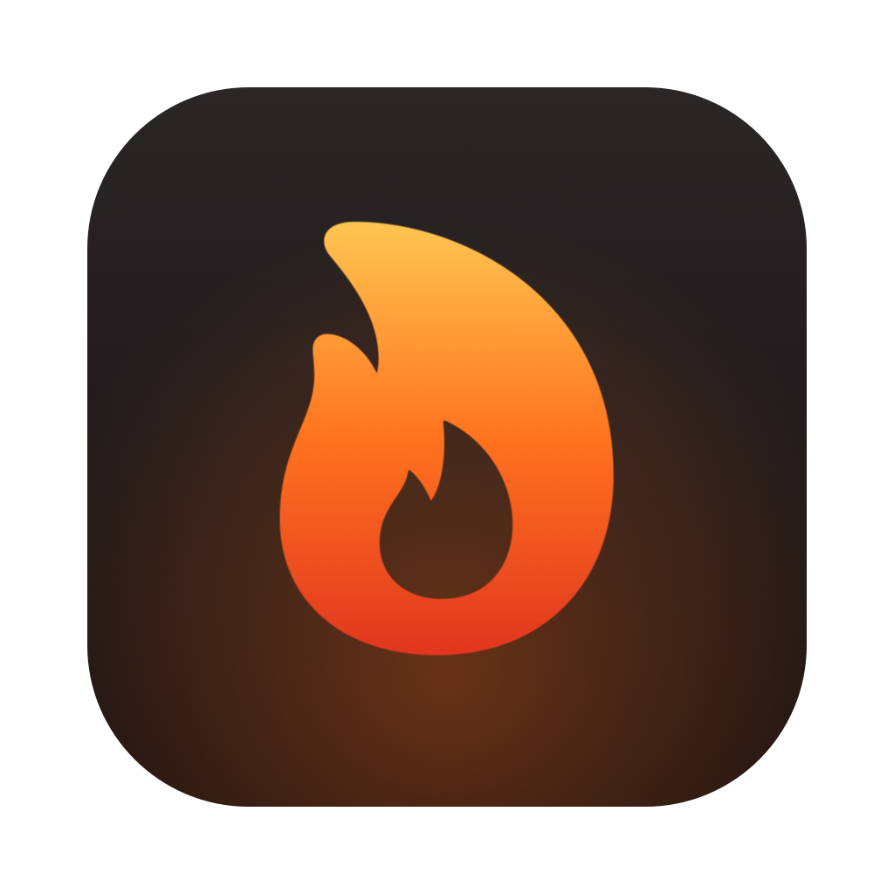
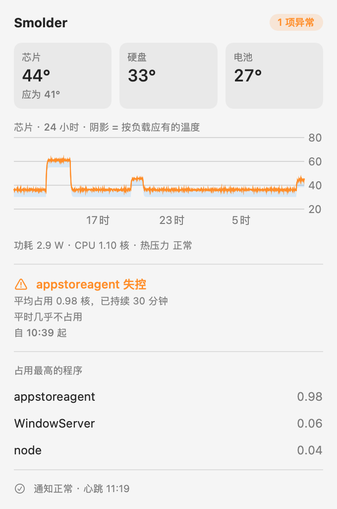

<p align="center">
  
</p>

<h1 align="center">Smolder</h1>

<p align="center"><b>合着盖子，也能抓住你的 Mac 在悄悄发烧。</b></p>

<p align="center"><a href="README.md">English</a></p>

---

Smolder 是一个菜单栏小软件，给那些常年开着、没人盯着看的 Mac 用：合盖放在架子上当家庭服务器的
MacBook、编译机、24 小时跑 AI 的机器。它会学习这台 Mac 平时是什么样，真出问题时把消息推到你手机上。

它来自一次真实事故：一个系统后台进程卡在重试循环里，在一台合盖的 MacBook Air 上吃满一个 CPU 核心
**整整 8 小时**，没人发现。设温度报警也没用：那天电池温度最高只有 30.6 °C，而前一周一次正常的半小时
重活就到了 33.5 °C。**固定的温度线，要么漏报，要么狼来了。**

所以 Smolder 不问「热不热」，而是问「以它现在干的活，该不该这么热」，以及「是不是有程序在干它平时从不干的活」。

<p align="center">
  
</p>

## 盯什么

| 报警 | 什么时候响 | 为什么不用固定线 |
|---|---|---|
| **程序失控** | 某个程序的 CPU 占用远超**它自己**的常态（≥ 0.5 核，且超过它 14 天峰值的 1.5 倍），持续 30 分钟 | 天天都忙的编译器、AI 程序不会被报；平时几乎不动、突然吃满一核的后台进程会 |
| **后台一直在忙** | 屏幕全关的情况下，最近两小时里**最安静的时刻**，功耗都比平时高 1.5 W 以上 | 正常干活抬高的是功耗峰值；停不下来的东西连安静时刻也一起抬高。屏幕亮着也会抬高底线，所以有人在用 Mac 时不判断这一条 |
| **温度高于负载应有水平** | 芯片比「按当前功耗应有的温度」高 3 °C 以上（或 4 倍残差 MAD），持续 20 分钟 | 学到的是功耗→温度的物理关系：重活跑得热是预料之中的，通风口被堵、房间太热才不是 |
| **硬上限** | 系统因过热降频持续 10 分钟、热压力严重，或电池 ≥ 35 °C | 永不学习、永不调整，兜住自适应部分可能漏掉的一切 |

每起异常只在开始时通知一次、恢复时再通知一次，不会刷屏。每条消息都写清楚测到了多少、应该是多少、
可能是谁干的。

模型怎么工作、背后的研究依据，见 [docs/how-it-works.md](docs/how-it-works.md)（英文）。

## 通知方式

- **macOS 通知**：有人坐在 Mac 前时用。
- **Telegram**：报警推到你的对话里，并且机器人能回答 `/status`，告诉你实时温度、负载和占用最高的程序。
  「设置 → 通知 → 自动识别」会帮你找到对话 ID。
- **Webhook**：每个事件 POST 一份 JSON，也可以带上心跳。
- **自定义命令**：运行任意命令，同样的 JSON 写进它的标准输入。可以经 SSH 转给自己的服务器、接 `ntfy`、写日志。
- **失联报警**：Smolder 没法报告自己挂了。把心跳发到 healthchecks.io、Uptime Kuma 或你自己的服务器，
  让**它们**在心跳停止时报警。

在终端运行 `/Applications/Smolder.app/Contents/MacOS/Smolder --test-notify`，可以给每个通知去处各发一条测试消息。
数据格式和接法：[docs/integrations.md](docs/integrations.md)（英文）。

## 安装

需要 Apple 芯片的 Mac，macOS 14 Sonoma 或更新版本。

**Homebrew**

```bash
brew install --cask penntiao/tap/smolder
```

**直接下载**：从 [Releases](https://github.com/penntiao/smolder/releases) 下载 zip，解压后把
`Smolder.app` 拖进「应用程序」，第一次打开时右键 → 打开。

**从源码编译**（只要命令行工具，不用装 Xcode）

```bash
git clone https://github.com/penntiao/smolder.git
cd smolder
scripts/build-app.sh --install
```

装好后打开「设置 → 通用」，勾上**登录时启动，崩溃后自动重启**。

> [!NOTE]
> Smolder 只做了本机签名，没有经过苹果公证（公证需要付费的苹果开发者账号）。Homebrew 安装完会去掉
> 「来自网络」的隔离标记，macOS 才会放它运行。不想信任现成的二进制，就从源码编译，一共约 2,500 行 Swift。

## 隐私与传感器

- 除非你配置了推送去处，所有数据都只留在本机。没有遥测、没有统计、不会偷偷联网检查更新。
- 不要 root、不装辅助程序、不装内核扩展。芯片温度来自 `IOHIDEventSystem` 传感器，功耗来自 SMC，
  各程序 CPU 占用来自 `/bin/ps`。这些是私有接口，以后的 macOS 可能会变；
  运行 `Smolder.app/Contents/MacOS/Smolder --probe` 可以看你的 Mac 能读到什么。
- 数据在 `~/Library/Application Support/Smolder/`：SQLite 历史（保留 90 天）、学到的模型，以及存 token 的
  `secrets.json`（权限 0600）。不放钥匙串，是因为本机签名的 App 每次更新后钥匙串都会弹窗要授权，
  而合盖的机器前没人能点。

## 局限

- 只支持 Apple 芯片，Intel Mac 的传感器不一样。
- 没有环境温度计：房间变热和散热变差看起来一样。Smolder 会在消息里直说，不瞎猜。
- 头 72 小时是学习期，这期间只用保守的固定规则。

## 参与

欢迎提 Issue 和 PR。报传感器问题时请附上 `--probe` 的输出和你的 Mac 型号。`swift test` 会跑异常判断的
场景测试（需要 Xcode；App 本身只用命令行工具就能编译）。

## 许可证

[MIT](LICENSE)
